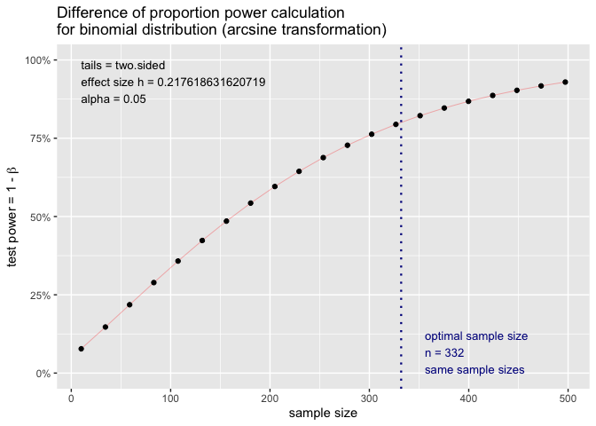
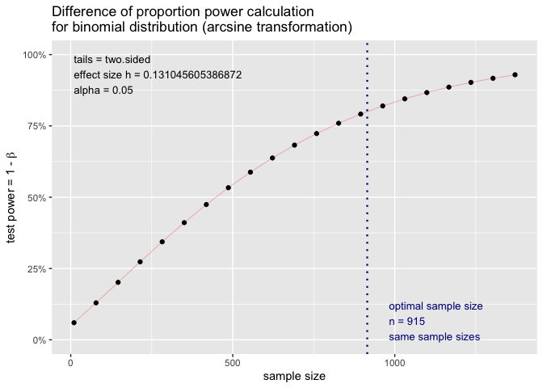
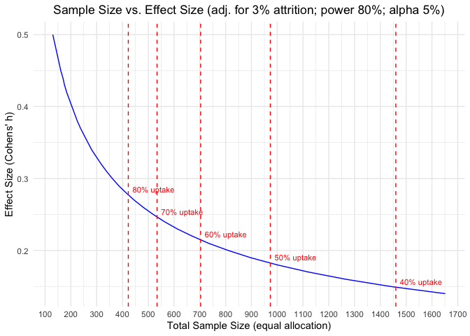

## Load packages

```r
library(tidyverse)
library(kableExtra)
library(ggplot2) # survival/TTE analyses and other graphs
library(pwr) # package for standard sample size calculations: https://cran.r-project.org/web/packages/pwr/vignettes/pwr-vignette.html / https://bookdown.org/pdr_higgins/rmrwr/sample-size-calculations-with-pwr.html 
```

## Literature
1. Reeves et al: https://pubmed.ncbi.nlm.nih.gov/29277558/
* Summary of methods challenges they had in their TwiCs: a) statistical power and sample size; b) Sampling procedures esp. when re-sampling from cohort to top-up sample size; c) the fixed data collection points
* Provide a step-by-step guide how to calculate the sample size for a TwiCs
* CLASSIC cohort: cohort of elderly people with comorbidities (n= ca. 4300) / TwiCs intervention: telephone coaching for lifestyle change
* They show how they were not able to reach adequate power with a low uptake of ca. 40% even with a cohort of 4300 participants
* However, their key assumption was (which is not discussed): ZERO effect among non-uptakers in intervention. This might be reasonable in their case, but for sure not in ours.

2. Pate et al: https://bmcmedresmethodol.biomedcentral.com/articles/10.1186/s12874-016-0208-1 
* Simulation study and sample size for a cluster-randomized TwiCs, including recommendation which IV estimator to use
* They argue that TwiCs suffer from "dilution bias" (hence, use an IV estimator)
* Disagree re "dilution bias", agree with Kessels et al (see below)

3. Candlish et al: https://bmcmedresmethodol.biomedcentral.com/articles/10.1186/s12874-017-0295-7 
* Simulation study and sample size for a individual-randomized TwiCs, including recommendation which IV estimator to use
* They argue that TwiCs suffer from "dilution bias" (hence, use an IV estimator)
* Disagree re "dilution bias", agree with Kessels et al (see below)

4. Kessels et al: https://bmcmedresmethodol.biomedcentral.com/articles/10.1186/s12874-023-01941-5
* Summary of methods challenges in TwiCs
* Argue that the "dilution bias" outlined by Pate et al and Candlish et al are not biases, but a question of interpretation (treatment effect vs. offer of treatment effect): "The authors reveal that the larger the refusal rate, the more bias was found in the ITT effect [...], but that should not be interpreted as bias. Again, [dilution] bias in the ITT effect of a TwiCs study should not be seen as bias relative to the ITT effect of a standard RCT, but relative to its own definition."
* I agree. However, of course, the non-uptake rate AFTER the TwiCs should be more or less the same as DURING the TwiCs. This will not always be the case, esp. when the TwiCs results are positive. 
* Then, the real effect will be somewhere between the ITT and the IV effect - and thus, as Pate et al and Candlish et al suggest, it is recommended to always show both analyses, the ITT and a per protocol analysis (using IV - or IPW)

5. Van der Velden et al: https://academic.oup.com/ije/article/46/1/96/2617171?login=false 
* Summary of how to analyse and interpret TwiCs
* They argue similar as Kessels et al. against a "dilution bias"
* Explain how to use IV estimators in TwiCs and underlying IV assumptions

6. Gal et al: https://pubmed.ncbi.nlm.nih.gov/31146022/
* UMBRELLA-FIT, sample size had to be adapted along the way due to lower uptake - but they argue that the recruitment period was still shorter than during a traditional RCT due to integration of recruitment in clinical routine and no recruitment efforts for control participants ("However, recruitment of 260 patients was still completed by one researcher within 30 months.") 
* Argue that their oncology TwiCs was more representative than a standard oncology RCT
* For detailed sample size calculation, see their study published study protocol 

7. Couwenberg et al: https://pubmed.ncbi.nlm.nih.gov/31866471/
* RECTAL-BOOST, sample size had to be adapted along the way due to lower uptake.
* Argue that their oncology TwiCs was more representative than a standard oncology RCT
* For detailed sample size calculation, see their study published study protocol 

## General remarks regarding random sampling and batch randomisation
1. Traditionally, the idea of TwiCs was about *random sampling*, i.e. randomize a few and ALL remaining eligible cohort participants are control (=> unequal allocation) and batch-randomisation (randomise all upfront)
* e.g. Reeves et al. "all cohort participants eligible for the treatment are first identified and then a random sample selected and offered the treatment, which they can either consent to receive or decline. All remaining eligible patients — that is, all patients eligible for the treatment but not offered it — constitute the control arm"
* e.g. Pate et al. "The same cohort can be used for multiple interventions. Each intervention is offered to a randomly selected sample of patients eligible for that intervention, who are then compared with the rest of the eligible patients from the cohort that are still being treated as usual"
* e.g. Van der Velden et al. "Moreover, the cohort allows for unequal randomization by making use of the (large) control group of the cohort. This may be especially attractive in the case of expensive experimental treatments, to reduce the costs of a trial."
* Reeves et al. provide a step-by-step explanation of a TwiCs sample size calculation and the limitation of such an upfront batch-randomization when uptake is low: Massive cohort needed if uptake lower than 50%; and careful batch re-sampling / re-randomization ("top-up") of sample size in case of lower than anticipated uptake
* Reeves et al.: "For comparison, Table 1 also shows the samples needed for a traditional pragmatic RCT under the same set of assumptions. There is a sharp contrast: the figures show that it would still be possible to fully power a traditional pragmatic RCT using the CLASSIC cohort with consent as low as 40%. However, at high consent rates — 70% or more — the TwiCs design has a considerable sample size advantage, requiring offering treatment to less than half as many patients as a traditional pragmatic RCT"

2. Batch randomisation obviously has the advantage that enrolment can be prepared (flagging of eligible) and is extremely efficient, but the disadvantage is that eligibility cannot be re-confirmed at enrolment.

3. Compromise: Use traditional rolling-basis randomization but with unequal allocation. This will increase power - but might also increase recruitment period. And one might save resources in intervention budget (however, if uptake low, then probably intervention budget saved)

4. In TwiCs, a valid question remains: Why not using all the other eligible cohort participants for control since we have them anyway as part of the TwiCs/cohort setup?

5. Sample Size calculation for RETUNE TwiCs, taking into account all guidance above and esp. sample size calculation according to Reeves et al: 
* We estimate that the mean effect across all participants in the control arm is 8.5% (SHCS data)
* We estimate that the mean effect in patients who accept any smoking cessation intervention is 20% (external data)
* We estimate that the mean effect in patients who accept any smoking cessation intervention is the same as in control (there is no good argument against, can be justified)
* With 100% uptake, we will have an effect delta of 11.5%
* With lower uptake, then the intervention effect becomes diluted as follows: (effect_int_uptake * uptake) + (effect_int_non_uptake * (1-uptake))
* Since we use the principal stratum strategy for the intercurrent event "LTFU" without predicting outcomes (e.g. no multiple imputation) but simply excluding them, we need to account for it in the sample size calculation. We assume 3% attrition (SHCS data, updated cohort profile publication)
* Our max. eligible cohort across the main enrolling sites is 1500 potentially eligible participants

## Fix parameters

```r
p_cont <- 0.085 # Estimated cessation proportion in control group (see details in study protocol)
p_int_uptake <- 0.2 # Estimated cessation proportion in intervention group, among uptakers (see details in study protocol)
p_int_non_uptake <- 0.085 # Estimated cessation proportion in intervention group, among non-uptakers (see details in study protocol)
alpha <- 0.05 # Significance level
power <- 0.80 # Desired power, keep it fixed at min. 80%
attrition <- 0.03 # attrition/LTFU rate across both arms (see updated SHCS cohort profile publication Scherrer et al.)
```

## 70% uptake incorporated in intervention, according to Reeves et al

```r
uptake <- 0.7 # 70% uptake
p_int <- (p_int_uptake*uptake) + (p_int_non_uptake*(1-uptake)) # Estimated proportion in intervention group, with non-uptake integrated
effect_delta <- p_int-p_cont

# print effect size
cat("effect size delta with non-uptake incorporated in intervention:", effect_delta)
```

```
## effect size delta with non-uptake incorporated in intervention: 0.0805
```

## Standard sample size for a binary outcome / individual randomized trial / with 70% uptake incorporated in intervention

```r
# Calculate the sample size using pwr, two-sided (effect could go either way) / https://cran.r-project.org/web/packages/pwr/vignettes/pwr-vignette.html 

# Calculate initial sample size, for one arm
sample_size_initial <- pwr.2p.test(h = ES.h(p_int, p_cont), sig.level = alpha, power = power)

# Adjust sample size for attrition, for one arm
sample_size_adjusted <- sample_size_initial$n / (1 - attrition)

# Total sample size
sample_size <- sample_size_adjusted * 2 

# Print results
cat("Initial Sample Size per Arm (without attrition):", ceiling(sample_size_initial$n), "\n")
```

```
## Initial Sample Size per Arm (without attrition): 259
```

```r
cat("Adjusted Sample Size per Arm (accounting for attrition):", ceiling(sample_size_adjusted), "\n")
```

```
## Adjusted Sample Size per Arm (accounting for attrition): 267
```

```r
cat("Total Sample Size (incl. accounting for attrition):", ceiling(sample_size), "\n")
```

```
## Total Sample Size (incl. accounting for attrition): 534
```

```r
plot(sample_size_initial)
```

<!-- -->

```r
### manual calculation // yields the same result !
# Z_alpha_half <- qnorm(1 - alpha / 2) # translate into Z-distribution -> equals 0.975 (95% CI) 
# Z_beta <- qnorm(power)
# 
# # calculate the sample size using the formula itself
# sample_size_1arm_man <- ((Z_alpha_half + Z_beta)^2 * (p_int * (1 - p_int) + p_cont * (1 - p_cont))) / (p_int - p_cont)^2 # for 1 arm
# sample_size_man <- sample_size_1arm_man * 2 # total sample size
# sample_size_man_final <- sample_size_man + (sample_size_man * attrition) # inflate for attrition
# 
# # print
# cat("Required Sample Size_manual:", round(sample_size_man_final, 0))
```

## 60% uptake incorporated in intervention, according to Reeves et al

```r
uptake <- 0.6 # 60% uptake
p_int <- (p_int_uptake*uptake) + (p_int_non_uptake*(1-uptake)) # Estimated proportion in intervention group, with non-uptake integrated
effect_delta <- p_int-p_cont

# print effect size
cat("effect size delta with non-uptake incorporated in intervention:", effect_delta)
```

```
## effect size delta with non-uptake incorporated in intervention: 0.069
```

## Standard sample size for a binary outcome / individual randomized trial / with 60% uptake incorporated in intervention

```r
# Calculate the sample size using pwr, two-sided (effect could go either way) / https://cran.r-project.org/web/packages/pwr/vignettes/pwr-vignette.html 

# Calculate initial sample size, for one arm
sample_size_initial <- pwr.2p.test(h = ES.h(p_int, p_cont), sig.level = alpha, power = power)

# Adjust sample size for attrition, for one arm
sample_size_adjusted <- sample_size_initial$n / (1 - attrition)

# Total sample size
sample_size <- sample_size_adjusted * 2 

# Print results
cat("Initial Sample Size per Arm (without attrition):", ceiling(sample_size_initial$n), "\n")
```

```
## Initial Sample Size per Arm (without attrition): 341
```

```r
cat("Adjusted Sample Size per Arm (accounting for attrition):", ceiling(sample_size_adjusted), "\n")
```

```
## Adjusted Sample Size per Arm (accounting for attrition): 351
```

```r
cat("Total Sample Size (incl. accounting for attrition):", ceiling(sample_size), "\n")
```

```
## Total Sample Size (incl. accounting for attrition): 702
```

```r
plot(sample_size_initial)
```

<!-- -->

## 50% uptake incorporated in intervention, according to Reeves et al

```r
uptake <- 0.5 # 50% uptake
p_int <- (p_int_uptake*uptake) + (p_int_non_uptake*(1-uptake)) # Estimated proportion in intervention group, with non-uptake integrated
effect_delta <- p_int-p_cont

# print effect size
cat("effect size delta with non-uptake incorporated in intervention:", effect_delta)
```

```
## effect size delta with non-uptake incorporated in intervention: 0.0575
```

## Standard sample size for a binary outcome / individual randomized trial / with 50% uptake incorporated in intervention

```r
# Calculate the sample size using pwr, two-sided (effect could go either way) / https://cran.r-project.org/web/packages/pwr/vignettes/pwr-vignette.html 

# Calculate initial sample size, for one arm
sample_size_initial <- pwr.2p.test(h = ES.h(p_int, p_cont), sig.level = alpha, power = power)

# Adjust sample size for attrition, for one arm
sample_size_adjusted <- sample_size_initial$n / (1 - attrition)

# Total sample size
sample_size <- sample_size_adjusted * 2 

# Print results
cat("Initial Sample Size per Arm (without attrition):", ceiling(sample_size_initial$n), "\n")
```

```
## Initial Sample Size per Arm (without attrition): 472
```

```r
cat("Adjusted Sample Size per Arm (accounting for attrition):", ceiling(sample_size_adjusted), "\n")
```

```
## Adjusted Sample Size per Arm (accounting for attrition): 486
```

```r
cat("Total Sample Size (incl. accounting for attrition):", ceiling(sample_size), "\n")
```

```
## Total Sample Size (incl. accounting for attrition): 972
```

```r
plot(sample_size_initial)
```

<!-- -->

## Plot Sample Size vs Effect Size

```r
# Redefine effect sizes to label on graph
uptake_40 <- 0.4 # 40% uptake
p_int_40 <- (p_int_uptake*uptake_40) + (p_int_non_uptake*(1-uptake_40))
uptake_50 <- 0.5 # 50% uptake
p_int_50 <- (p_int_uptake*uptake_50) + (p_int_non_uptake*(1-uptake_50))
uptake_60 <- 0.6 # 60% uptake
p_int_60 <- (p_int_uptake*uptake_60) + (p_int_non_uptake*(1-uptake_60))
uptake_70 <- 0.7 # 70% uptake
p_int_70 <- (p_int_uptake*uptake_70) + (p_int_non_uptake*(1-uptake_70))
uptake_80 <- 0.8 # 80% uptake
p_int_80 <- (p_int_uptake*uptake_80) + (p_int_non_uptake*(1-uptake_80))

# Converted cohens' h effect sizes:
h_40 <- ES.h(p_int_40, p_cont)
h_50 <- ES.h(p_int_50, p_cont)
h_60 <- ES.h(p_int_60, p_cont)
h_70 <- ES.h(p_int_70, p_cont)
h_80 <- ES.h(p_int_80, p_cont)

effect_sizes <- seq(0.1, 0.5, by = 0.01)
sample_sizes <- numeric(length(effect_sizes))

# Loop through effect sizes and calculate the corresponding adjusted sample size
for (i in seq_along(effect_sizes)) {
  result <- pwr.2p.test(h = effect_sizes[i], sig.level = alpha, power = power)
  sample_size <- ceiling(result$n) * 2  # Total sample size for both arms
  sample_sizes[i] <- sample_size / (1 - attrition)  # Adjust for attrition
}

# Create a data frame for plotting, but restrict to max total sample size 1800
data <- data.frame(SampleSize = sample_sizes, EffectSize = effect_sizes)
filtered_data <- data[data$SampleSize <= 1800, ]

# Calculate adjusted sample sizes for specific effect sizes
h_values <- c(h_40, h_50, h_60, h_70, h_80)
sample_sizes_for_labels <- sapply(h_values, function(h) {
  result <- pwr.2p.test(h = h, sig.level = alpha, power = power)
  sample_size <- ceiling(result$n) * 2  # Total sample size for both arms
  sample_size / (1 - attrition)  # Adjust for attrition
})

# Create labels
label_data <- data.frame(
  EffectSize = h_values,
  SampleSize = sample_sizes_for_labels,
  Label = c("40% uptake", "50% uptake", "60% uptake", "70% uptake", "80% uptake")
)

# Plot using ggplot2
ggplot(filtered_data, aes(x = SampleSize, y = EffectSize)) +
  geom_line(color = "blue") +
  geom_vline(data = label_data, aes(xintercept = SampleSize), linetype = "dashed", color = "red") +
  geom_text(data = label_data, aes(x = SampleSize, y = EffectSize, label = Label), 
            hjust = -0.1, vjust = -0.5, color = "red", size = 3) +
  labs(
    title = "Sample Size vs. Effect Size (adj. for 3% attrition; power 80%; alpha 5%)",
    x = "Total Sample Size (equal allocation)",
    y = "Effect Size (Cohens' h)"
  ) +
  xlim(0, 1800) +  # Limit x-axis to 1800
  scale_x_continuous(breaks = seq(0, 1800, by = 100)) +  # Adapt in case of x-axis limit change
  theme_minimal() +
  theme(plot.title = element_text(hjust = 0.5))
```

<!-- -->

## Now, let's use unequal allocation
* With 50% uptake, we only want max. 300 participants in intervention (=> 150 max. use any product) 
* Max. eligible cohort is 1500

### According to Reeves et al

```r
# n_int <- 300
# n_cont <- (sample_size_initial$n*n_int)/((2*n_int)-sample_size_initial$n)
# 
# # Adjust sample size for attrition, for n1 arm (intervention)
# n_int_adjusted <- n_int / (1 - attrition)
# 
# # Adjust sample size for attrition, for n2 arm (control)
# n_cont_adjusted <- n_cont / (1 - attrition)
# 
# # Total sample size, accounting for attrition
# n_tot_adjusted <- n_int_adjusted + n_cont_adjusted
# 
# # print
# cat("Adjusted Sample Size for Control Arm (accounting for attrition):", ceiling(n_cont_adjusted), "\n")
# cat("Total Adjusted Sample Size (accounting for attrition):", ceiling(n_tot_adjusted), "\n")
```

### According to pwr

```r
# sample_size_1arm <- pwr.2p2n.test(h = ES.h(p_int, p_cont), 
#                            sig.level = alpha, 
#                            power = power,
#                            n1 = 300,
#                            n2 = NULL, 
#                            alternative = "two.sided") # for 1 arm
# 
# # Adjust sample size for attrition, for n1 arm (intervention)
# n_int_adjusted <- sample_size_1arm$n1 / (1 - attrition)
# 
# # Adjust sample size for attrition, for n2 arm (control)
# n_cont_adjusted <- sample_size_1arm$n2 / (1 - attrition)
# 
# # Total sample size, accounting for attrition
# n_tot_adjusted <- n_int_adjusted + n_cont_adjusted
# 
# 
# # print
# cat("Adjusted Sample Size for Control Arm (accounting for attrition):", ceiling(n_cont_adjusted), "\n")
# cat("Total Adjusted Sample Size (accounting for attrition):", ceiling(n_tot_adjusted), "\n")
# 
# plot(sample_size_1arm)
```

## EXAMPLES
### UMBRELLA-FIT
https://trialsjournal.biomedcentral.com/articles/10.1186/s13063-017-2252-5 
"Sample size calculation
The sample size calculation is based on the intention-to-treat analyses of the primary effectiveness outcome QoL (EORTC-QLQ-30) [30]. Here, we determine a clinically relevant difference as a difference of 10 points [30]. A difference of 10 points is realistic because in a previous exercise trial in patients with cancer, QoL in the intervention group improved by 15.1 points (SD 17.7) and in the control group by 6.1 points (SD 17.1) using the EORTC-QLQ-30 after the 12-week intervention [34, 35]. Therefore, using the control group data from the previous trial and the 10-point difference, we assume a 6-point increase in QoL in the control group and a 16-point increase in the intervention group, among patients who accept the intervention in this cmRCT. We expect an attendance rate of 70% in the intervention group and assume that the improvement in non-attenders randomized to the intervention group (30%) is equal to the improvement in the control group (i.e. 6 points). Furthermore, we assume that non-attendance does not impact the standard deviation. As a result, we estimate a mean improvement of 13 points in the intervention group ((70x16 + 30x6)/100 = 13) instead of 16 points and a mean improvement of 6 points in the control group. Using these numbers, standard deviations of 17.7 and 17.1, power of 80% and alpha of 0.05, we calculated that 98 patients are needed in each group.
As we will use linear regression analyses adjusted for baseline, the correlation between baseline and follow up needs to be taken into account in the sample size calculation. Therefore, the calculated number of subjects should be multiplied by (1-ρ 2), plus one extra subject per group [36], where ρ represents the correlation between baseline and follow-up outcomes. In our previous trials [34, 35], we identified correlation of 0.4 between baseline and follow-up QoL. This leads to a final sample size of 83 patients per group (98*0.84 + 1). As recommended by Candlish [37], we will update the sample-size calculation before the end of the trial when the actual acceptance rate of the intervention deviates from the estimated rate and adapt the sample size accordingly."

```r
uptake <- 0.7 # 70% uptake
mean_cont <- 6 # Estimated mean point increase in QoL in control
sd_cont <- 17.1 # Estimated SD in QoL in control
mean_int <- 16 # Estimated mean point increase in QoL in int
sd_int <- 17.7 # Estimated SD in QoL in int
mean_int_non_uptake <- 6 # Estimated mean point increase in QoL in int, among non-uptakers
sd_int_non_uptake <- 17.7 # Estimated SD in QoL in int, among non-uptakers

mean_int <- (mean_int*uptake) + (mean_int_non_uptake*(1-uptake)) # Estimated mean point increase in intervention group, with non-uptake integrated
effect_delta <- mean_int-mean_cont

# print effect size
cat("effect size delta with non-uptake incorporated in intervention:", effect_delta)
```

```
## effect size delta with non-uptake incorporated in intervention: 7
```

#### Standard sample size for a cont outcome / individual randomized trial 

```r
### Use pwr https://bookdown.org/pdr_higgins/rmrwr/sample-size-calculations-with-pwr.html / https://cran.r-project.org/web/packages/pwr/vignettes/pwr-vignette.html 
sd_pooled <- (sd_cont + sd_int + sd_int_non_uptake)/3
d <- effect_delta/sd_pooled # Cohen’s d: Difference between the means at the endpoint, divided by the pooled standard deviation.

sample_size_1arm <- pwr.t.test(n = NULL,
                sig.level = 0.05, 
                type = "two.sample", 
                alternative = "two.sided", 
                power = 0.80, 
                d = d) 
# 99 in each group, correct

sample_size <- sample_size_1arm$n * 2 # total sample size
sample_size_final <- sample_size + (sample_size * attrition) # inflate for attrition

# print
cat("Required Sample Size_pwr:", round(sample_size_final, 0))
```

```
## Required Sample Size_pwr: 204
```
=> correct, see UMBRELLA-FIT (but they used ANCOVA, not t-test => further reduction in sample size)

### RECTAL-BOOST
https://trialsjournal.biomedcentral.com/articles/10.1186/s13063-015-0586-4 
"Sample size considerations
On the basis of our center’s experience, we assume that 13% of patients will reach pCR if undergoing sCRT. On the basis of a prediction model published by Appelt et al. [30], we expect the pCR rate to be 30% after 65 Gy treatment. Because we consider this study to constitute preliminary work for subsequent studies aimed at evaluating even higher dose increases, we deem it important to find an effect if there really is one, but less important to unjustly find an effect. Therefore, we will use a one-sided α of 15% because it is unlikely that the pCR rate after boost treatment plus sCRT will be lower than after sCRT alone, in combination with a power of 80% because we do not want to increase uncertainty when a negative result is achieved. We further expect that approximately 80% of the patients who receive a boost offer will accept it. Patients who are offered the boost treatment but refuse to undergo the boost will remain in the intervention arm for analysis but receive sCRT (Figure 1). We expect no cross-over from the control arm to the intervention arm, because only patients who are randomly selected to receive a boost offer are informed about and offered it, whereas all non-selected patients undergo standard treatment (that is, sCRT) without receiving information about the boost trial. Taking into account the estimated response rates, together with a 20% refusal rate in the intervention arm, we require 60 patients per arm to demonstrate a statistically significant difference. We expect to complete recruitment within 3 years."

```r
# Define the parameters
p_cont <- 0.13
uptake <- 0.8 # 80% uptake
p_int_uptake <- 0.30
p_int_non_uptake <- 0.13 # this is not explicitely mentioned, but makes sense since their intervention is an ADD-ON radio
p_int <- (p_int_uptake*uptake) + (p_int_non_uptake*(1-uptake)) # Estimated proportion in intervention group, with non-uptake integrated
effect_delta <- p_int-p_cont

# print effect size
cat("effect size delta with non-uptake incorporated in intervention:", effect_delta)
```

```
## effect size delta with non-uptake incorporated in intervention: 0.136
```

#### Standard sample size for a prop outcome / individual randomized trial 

```r
### Use pwr https://bookdown.org/pdr_higgins/rmrwr/sample-size-calculations-with-pwr.html / https://cran.r-project.org/web/packages/pwr/vignettes/pwr-vignette.html 
# Define the parameters
p_int <- p_int 
p_cont <- p_cont 
alpha <- 0.15 
power <- 0.80 
attrition <- 0.0 

# calculate the sample size using pwr, two-sided (effect could go either way)
sample_size_1arm <- pwr.2p.test(h = ES.h(p_int, p_cont), 
                           sig.level = alpha, 
                           power = power,
                           alternative = "greater") # for 1 arm
sample_size <- sample_size_1arm$n * 2 # total sample size
sample_size_final <- sample_size + (sample_size * attrition) # inflate for attrition
# print
cat("Required Sample Size_pwr:", round(sample_size_final, 0))
```

```
## Required Sample Size_pwr: 118
```
=> correct, see RECTAL-BOOST


