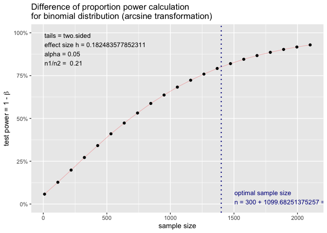

## Load packages

```r
library(tidyverse)
library(kableExtra)
library(ggplot2) # survival/TTE analyses and other graphs
library(pwr) # sample size calculation: https://cran.r-project.org/web/packages/pwr/vignettes/pwr-vignette.html / https://bookdown.org/pdr_higgins/rmrwr/sample-size-calculations-with-pwr.html 
```

## Resources
1. Kessels et al: https://bmcmedresmethodol.biomedcentral.com/articles/10.1186/s12874-023-01941-5
2. Gal et al: https://pubmed.ncbi.nlm.nih.gov/31146022/ 
3. Couwenberg et al: https://pubmed.ncbi.nlm.nih.gov/31866471/
4. *Reeves et al*: https://pubmed.ncbi.nlm.nih.gov/29277558/
5. *Pate et al*: https://bmcmedresmethodol.biomedcentral.com/articles/10.1186/s12874-016-0208-1 
6. *Candlish et al*: https://bmcmedresmethodol.biomedcentral.com/articles/10.1186/s12874-017-0295-7 
7. *Van der Velden et al*: https://academic.oup.com/ije/article/46/1/96/2617171?login=false 

## General remarks
1. Traditionally, the idea of TwiCs was about *random sampling*, i.e. randomize a few and ALL remaining eligible cohort participants are control => unequal allocation: 
* e.g. Reeves et al. "all cohort participants eligible for the treatment are first identified and then a random sample selected and offered the treatment, which they can either consent to receive or decline. All remaining eligible patients — that is, all patients eligible for the treatment but not offered it — constitute the control arm" or Pate et al. "The same cohort can be used for multiple interventions. Each intervention is offered to a randomly selected sample of patients eligible for that intervention, who are then compared with the rest of the eligible patients from the cohort that are still being treated as usual" or Van der Velden et al. "Moreover, the cohort allows for unequal randomization by making use of the (large) control group of the cohort. This may be especially attractive in the case of expensive experimental treatments, to reduce the costs of a trial."
* Reeves et al. provide a step-by-step explanation of a TwiCs sample size calculation and the limitation of such an upfront batch-randomization when uptake is low: Massive cohort needed if uptake lower than 50%; and careful batch re-sampling/re-randomization ("top-up") of sample size in case of lower than anticipated uptake
* Reeves et al.: "For comparison, Table 1 also shows the samples needed for a traditional pragmatic RCT under the same set of assumptions. There is a sharp contrast: the figures show that it would still be possible to fully power a traditional pragmatic RCT using the CLASSIC cohort with consent as low as 40%. However, at high consent rates — 70% or more — the TwiCs design has a considerable sample size advantage, requiring offering treatment to less than half as many patients as a traditional pragmatic RCT"

2. This can be achieved by either batch randomisation, as proposed by most (see Reeves) and has the advantage that enrolment can be prepared (flagging of eligible) and is extremly efficient, but the disadvantage that eligibility cannot be re-confirmed at enrolment.

3. Compromise: Use continuous randomization but with e.g. 2:1 allocation. This will increase power, but might increase recruitment period. 

4. Because the question really is: Why not using all the other eligible cohort participants for control in a TwiCs/cohort setup?

5. Sample Size calculation for TwiCs, including non-uptake in intervention according to Reeves et al: 
* Suppose that in RETUNE, the mean effect across all participants in the control arm will be 8.5%
* Suppose that in RETUNE, the mean effect in patients who accept any smoking cessation intervention is 20% 
* Suppose that in RETUNE, the mean effect in patients who accept any smoking cessation intervention is 0? or 8.5%? or 5%?
* 100% uptake: effect delta will be 11.5%
* If lower uptake, then intervention effect diluted: effect_int_uptake * non_uptake + effect_int_non_uptake * (1-non_uptake) => effect delta lower
* attrition???

## fix parameters

```r
p_cont <- 0.085 # Estimated cessation proportion in control group
p_int_uptake <- 0.2 # Estimated cessation proportion in intervention group, among uptakers
p_int_non_uptake <- 0.05 # or 0.085 or 0 ??? # Estimated cessation proportion in intervention group, among non-uptakers
alpha <- 0.05 # Significance level
power <- 0.80 # Desired power 
attrition <- 0.0 # attrition/LTFU rate across both arms?
```

## 70% non-uptake incorporated in intervention, according to Reeves et al

```r
non_uptake <- 0.7 # 70% uptake
p_int <- (p_int_uptake*non_uptake) + (p_int_non_uptake*(1-non_uptake)) # Estimated proportion in intervention group, with non-uptake integrated
effect_delta <- p_int-p_cont

# print effect size
cat("effect size delta with non-uptake incorporated in intervention:", effect_delta)
```

```
## effect size delta with non-uptake incorporated in intervention: 0.07
```

## Standard sample size for a binary outcome / individual randomized trial / with 70% non-uptake incorporated in intervention

```r
### Use pwr
# calculate the sample size using pwr, two-sided (effect could go either way) / https://cran.r-project.org/web/packages/pwr/vignettes/pwr-vignette.html 
sample_size_1arm <- pwr.2p.test(h = ES.h(p_int, p_cont), 
                           sig.level = alpha, 
                           power = power) # for 1 arm
sample_size <- sample_size_1arm$n * 2 # total sample size
sample_size_final <- sample_size + (sample_size * attrition) # inflate for attrition
# print
cat("Required Sample Size_pwr:", round(sample_size_final, 0))
```

```
## Required Sample Size_pwr: 663
```

```r
plot(sample_size_1arm)
```

<!-- -->

```r
### manual calculation // yields the same result
# Z_alpha_half <- qnorm(1 - alpha / 2) # translate into Z-distribution -> equals 0.975 (95% CI) 
# Z_beta <- qnorm(power)
# 
# # calculate the sample size using the formula itself
# sample_size_1arm_man <- ((Z_alpha_half + Z_beta)^2 * (p_int * (1 - p_int) + p_cont * (1 - p_cont))) / (p_int - p_cont)^2 # for 1 arm
# sample_size_man <- sample_size_1arm_man * 2 # total sample size
# sample_size_man_final <- sample_size_man + (sample_size_man * attrition) # inflate for attrition
# 
# # print
# cat("Required Sample Size_manual:", round(sample_size_man_final, 0))
```

## 60% non-uptake incorporated in intervention, according to Reeves et al

```r
non_uptake <- 0.6 # 60% uptake
p_int <- (p_int_uptake*non_uptake) + (p_int_non_uptake*(1-non_uptake)) # Estimated proportion in intervention group, with non-uptake integrated
effect_delta <- p_int-p_cont

# print effect size
cat("effect size delta with non-uptake incorporated in intervention:", effect_delta)
```

```
## effect size delta with non-uptake incorporated in intervention: 0.055
```

## Standard sample size for a binary outcome / individual randomized trial / with 60% non-uptake incorporated in intervention

```r
### Use pwr
# calculate the sample size using pwr, two-sided (effect could go either way) / https://cran.r-project.org/web/packages/pwr/vignettes/pwr-vignette.html 
sample_size_1arm <- pwr.2p.test(h = ES.h(p_int, p_cont), 
                           sig.level = alpha, 
                           power = power) # for 1 arm
sample_size <- sample_size_1arm$n * 2 # total sample size
sample_size_final <- sample_size + (sample_size * attrition) # inflate for attrition

# print
cat("Required Sample Size_pwr:", round(sample_size_final, 0))
```

```
## Required Sample Size_pwr: 1022
```

```r
plot(sample_size_1arm)
```

<!-- -->

## 50% non-uptake incorporated in intervention, according to Reeves et al

```r
non_uptake <- 0.5 # 50% uptake
p_int <- (p_int_uptake*non_uptake) + (p_int_non_uptake*(1-non_uptake)) # Estimated proportion in intervention group, with non-uptake integrated
effect_delta <- p_int-p_cont

# print effect size
cat("effect size delta with non-uptake incorporated in intervention:", effect_delta)
```

```
## effect size delta with non-uptake incorporated in intervention: 0.04
```

## Standard sample size for a binary outcome / individual randomized trial / with 50% non-uptake incorporated in intervention

```r
### Use pwr
sample_size_1arm <- pwr.2p.test(h = ES.h(p_int, p_cont), 
                           sig.level = alpha, 
                           power = power) # for 1 arm
sample_size <- sample_size_1arm$n * 2 # total sample size
sample_size_final <- sample_size + (sample_size * attrition) # inflate for attrition

# print
cat("Required Sample Size_pwr:", round(sample_size_final, 0))
```

```
## Required Sample Size_pwr: 1828
```

```r
plot(sample_size_1arm)
```

<!-- -->

## Now, let's assume we can only offer treatment to max. 500 participants -> unequal allocation
### with 50% non-uptake (all parameters see above)

### According to Reeves et al

```r
n_int <- 500
n_cont <- (sample_size_1arm$n*n_int)/((2*n_int)-sample_size_1arm$n)
n_tot <- n_cont + n_int

# print n_cont
cat("Required Sample Size_unequal_cont:", round(n_cont, 0))
```

```
## Required Sample Size_unequal_cont: 5320
```

```r
# print n_tot
cat("Required Sample Size_unequal_tot:", round(n_tot, 0))
```

```
## Required Sample Size_unequal_tot: 5820
```

## According to pwr

```r
sample_size_1arm <- pwr.2p2n.test(h = ES.h(p_int, p_cont), 
                           sig.level = alpha, 
                           power = power,
                           n1 = 500,
                           n2 = NULL, 
                           alternative = "two.sided") # for 1 arm
n_int <- sample_size_1arm$n1
n_cont <- sample_size_1arm$n2
n_tot <- n_int + n_cont
sample_size_final <- n_tot + (n_tot * attrition) # inflate for attrition

# print
cat("Required Sample Size_unequal_cont_pwr:", round(n_cont, 0))
```

```
## Required Sample Size_unequal_cont_pwr: 5320
```

```r
# print
cat("Required Sample Size_unequal_tot_pwr:", round(sample_size_final, 0))
```

```
## Required Sample Size_unequal_tot_pwr: 5820
```

```r
plot(sample_size_1arm)
```

<!-- -->


## EXAMPLES
### UMBRELLA-FIT
https://trialsjournal.biomedcentral.com/articles/10.1186/s13063-017-2252-5 
"Sample size calculation
The sample size calculation is based on the intention-to-treat analyses of the primary effectiveness outcome QoL (EORTC-QLQ-30) [30]. Here, we determine a clinically relevant difference as a difference of 10 points [30]. A difference of 10 points is realistic because in a previous exercise trial in patients with cancer, QoL in the intervention group improved by 15.1 points (SD 17.7) and in the control group by 6.1 points (SD 17.1) using the EORTC-QLQ-30 after the 12-week intervention [34, 35]. Therefore, using the control group data from the previous trial and the 10-point difference, we assume a 6-point increase in QoL in the control group and a 16-point increase in the intervention group, among patients who accept the intervention in this cmRCT. We expect an attendance rate of 70% in the intervention group and assume that the improvement in non-attenders randomized to the intervention group (30%) is equal to the improvement in the control group (i.e. 6 points). Furthermore, we assume that non-attendance does not impact the standard deviation. As a result, we estimate a mean improvement of 13 points in the intervention group ((70x16 + 30x6)/100 = 13) instead of 16 points and a mean improvement of 6 points in the control group. Using these numbers, standard deviations of 17.7 and 17.1, power of 80% and alpha of 0.05, we calculated that 98 patients are needed in each group.
As we will use linear regression analyses adjusted for baseline, the correlation between baseline and follow up needs to be taken into account in the sample size calculation. Therefore, the calculated number of subjects should be multiplied by (1-ρ 2), plus one extra subject per group [36], where ρ represents the correlation between baseline and follow-up outcomes. In our previous trials [34, 35], we identified correlation of 0.4 between baseline and follow-up QoL. This leads to a final sample size of 83 patients per group (98*0.84 + 1). As recommended by Candlish [37], we will update the sample-size calculation before the end of the trial when the actual acceptance rate of the intervention deviates from the estimated rate and adapt the sample size accordingly."

```r
non_uptake <- 0.7 # 70% uptake
mean_cont <- 6 # Estimated mean point increase in QoL in control
sd_cont <- 17.1 # Estimated SD in QoL in control
mean_int <- 16 # Estimated mean point increase in QoL in int
sd_int <- 17.7 # Estimated SD in QoL in int
mean_int_non_uptake <- 6 # Estimated mean point increase in QoL in int, among non-uptakers
sd_int_non_uptake <- 17.7 # Estimated SD in QoL in int, among non-uptakers

mean_int <- (mean_int*non_uptake) + (mean_int_non_uptake*(1-non_uptake)) # Estimated mean point increase in intervention group, with non-uptake integrated
effect_delta <- mean_int-mean_cont

# print effect size
cat("effect size delta with non-uptake incorporated in intervention:", effect_delta)
```

```
## effect size delta with non-uptake incorporated in intervention: 7
```

#### Standard sample size for a cont outcome / individual randomized trial 

```r
### Use pwr https://bookdown.org/pdr_higgins/rmrwr/sample-size-calculations-with-pwr.html / https://cran.r-project.org/web/packages/pwr/vignettes/pwr-vignette.html 
sd_pooled <- (sd_cont + sd_int + sd_int_non_uptake)/3
d <- effect_delta/sd_pooled # Cohen’s d: Difference between the means at the endpoint, divided by the pooled standard deviation.

sample_size_1arm <- pwr.t.test(n = NULL,
                sig.level = 0.05, 
                type = "two.sample", 
                alternative = "two.sided", 
                power = 0.80, 
                d = d) 
# 99 in each group, correct

sample_size <- sample_size_1arm$n * 2 # total sample size
sample_size_final <- sample_size + (sample_size * attrition) # inflate for attrition

# print
cat("Required Sample Size_pwr:", round(sample_size_final, 0))
```

```
## Required Sample Size_pwr: 198
```
=> correct, see UMBRELLA-FIT (but they used ANCOVA, not t-test => further reduction in sample size)

### RECTAL-BOOST
https://trialsjournal.biomedcentral.com/articles/10.1186/s13063-015-0586-4 
"Sample size considerations
On the basis of our center’s experience, we assume that 13% of patients will reach pCR if undergoing sCRT. On the basis of a prediction model published by Appelt et al. [30], we expect the pCR rate to be 30% after 65 Gy treatment. Because we consider this study to constitute preliminary work for subsequent studies aimed at evaluating even higher dose increases, we deem it important to find an effect if there really is one, but less important to unjustly find an effect. Therefore, we will use a one-sided α of 15% because it is unlikely that the pCR rate after boost treatment plus sCRT will be lower than after sCRT alone, in combination with a power of 80% because we do not want to increase uncertainty when a negative result is achieved. We further expect that approximately 80% of the patients who receive a boost offer will accept it. Patients who are offered the boost treatment but refuse to undergo the boost will remain in the intervention arm for analysis but receive sCRT (Figure 1). We expect no cross-over from the control arm to the intervention arm, because only patients who are randomly selected to receive a boost offer are informed about and offered it, whereas all non-selected patients undergo standard treatment (that is, sCRT) without receiving information about the boost trial. Taking into account the estimated response rates, together with a 20% refusal rate in the intervention arm, we require 60 patients per arm to demonstrate a statistically significant difference. We expect to complete recruitment within 3 years."

```r
# Define the parameters
p_cont <- 0.13
non_uptake <- 0.8 # 80% uptake
p_int_uptake <- 0.30
p_int_non_uptake <- 0.13 # this is not explicitely mentioned, but makes sense since their intervention is an ADD-ON radio
p_int <- (p_int_uptake*non_uptake) + (p_int_non_uptake*(1-non_uptake)) # Estimated proportion in intervention group, with non-uptake integrated
effect_delta <- p_int-p_cont

# print effect size
cat("effect size delta with non-uptake incorporated in intervention:", effect_delta)
```

```
## effect size delta with non-uptake incorporated in intervention: 0.136
```

#### Standard sample size for a prop outcome / individual randomized trial 

```r
### Use pwr https://bookdown.org/pdr_higgins/rmrwr/sample-size-calculations-with-pwr.html / https://cran.r-project.org/web/packages/pwr/vignettes/pwr-vignette.html 
# Define the parameters
p_int <- p_int 
p_cont <- p_cont 
alpha <- 0.15 
power <- 0.80 
attrition <- 0.0 

# calculate the sample size using pwr, two-sided (effect could go either way)
sample_size_1arm <- pwr.2p.test(h = ES.h(p_int, p_cont), 
                           sig.level = alpha, 
                           power = power,
                           alternative = "greater") # for 1 arm
sample_size <- sample_size_1arm$n * 2 # total sample size
sample_size_final <- sample_size + (sample_size * attrition) # inflate for attrition
# print
cat("Required Sample Size_pwr:", round(sample_size_final, 0))
```

```
## Required Sample Size_pwr: 118
```
=> correct, see RECTAL-BOOST

